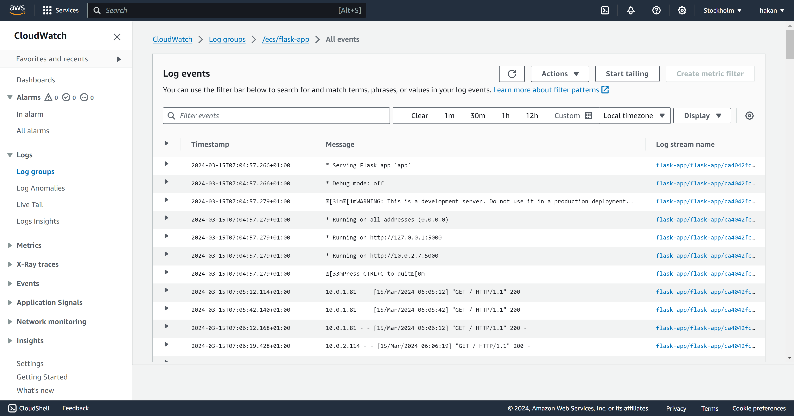
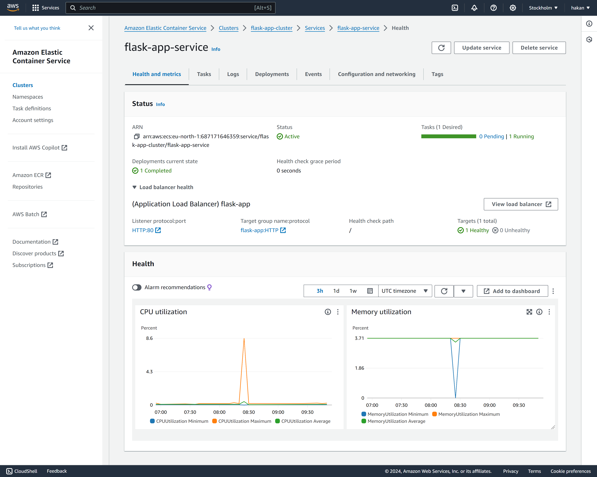

# Terraform AWS Project Repository

This repository contains Terraform code for deploying a Flask application, a DocumentDB cluster, and an Apache Spark instance on AWS. The project is divided into three main infrastructures, each tailored to specific use cases. Below is a general overview of each infrastructure and guidance on how to use the configurations.

## Prerequisites

Before you begin, ensure you have the following:
- An AWS account
- Terraform installed on your machine
- AWS CLI configured with access credentials

## Infrastructures

- [**Flask Application on AWS**](./app_infra/README.md): Deploys a Flask application using AWS ECS, ECR, and other services.
- [**DocumentDB Cluster**](./db_infra/README.md): Sets up a DocumentDB cluster with monitoring and alerting.
- [**Apache Spark Instance**](./spark/README.md): Provisions an environment for an Apache Spark instance.

## Infrastructure 1: Flask Application on AWS

This infrastructure deploys a Flask application using Amazon ECS, ECR, and other AWS services. The setup includes creating an ECR repository, ECS cluster, task definitions, and configuring a CI/CD pipeline using AWS CodePipeline for automated builds and deployments.

### Components
- **ECR Repository:** Docker container registry for storing Flask application images.
- **ECS Cluster & Service:** Container orchestration service to manage and scale the Flask application.
- **CI/CD Pipeline:** Automates the build, test, and deployment phases using AWS CodePipeline and CodeBuild.

### Deployment Steps
1. Clone the repository.
2. Navigate to the Flask application directory.
3. Initialize Terraform: `terraform init`
4. Apply the Terraform configuration: `terraform apply`

## Infrastructure 2: DocumentDB Cluster

Sets up a DocumentDB cluster with a single instance and configures CloudWatch alarms for monitoring CPU utilization. It also includes an SNS topic for alarm notifications.

### Components
- **DocumentDB Cluster:** Managed NoSQL database service compatible with MongoDB.
- **CloudWatch Alarm:** Monitors CPU utilization and sends notifications to an SNS topic.

### Deployment Steps
1. Navigate to the DocumentDB directory.
2. Initialize and apply the Terraform configuration as described above.

## Infrastructure 3: Apache Spark Instance

Provisions an AWS environment for an Apache Spark instance, including a VPC, security group, and an EC2 instance with Apache Spark installed.

### Components
- **VPC & Subnet:** Networking setup for the Spark instance.
- **Security Group:** Controls access to the Spark instance.
- **EC2 Instance:** Virtual server for running Apache Spark.

### Deployment Steps
1. Navigate to the Apache Spark directory.
2. Initialize and apply the Terraform configuration as described above.

## Variable Configuration

Each infrastructure requires specific variables to be set. Refer to the `variables.tf` file in each directory for required values. Configure these variables according to your AWS environment and project needs.

## Cleanup

To remove the deployed resources, run `terraform destroy` in the respective infrastructure directory. Confirm the destruction when prompted.

## Screenshots AWS

### CI / CD Flask App

---

### DocumentDB

---

### Apache Spark

